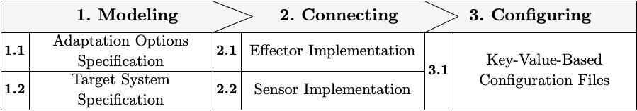

# Enhancing a Communication System with Adaptive Behavior using REACT

This folder contains supplementary material of the ACSOS 2020 demo paper submission presenting REACT. The demo will show how to enhance the exisiting system [SWIM](https://github.com/cps-sei/swim) with adaptive behavior using REACT. This follows the development process shown below which is specified in detail as part of the full paper.

The Adaptation Options Specification (AOS) and Target System Specification (TSS) can be found in the `configs` folder. For connecting REACT to SWIM, the folder Python-Interface contains the intermediate layer implementing REACT's interfaces and connecting to the socket provided by SWIM. Finally, `configs` contains all key-value-based configuration files for running REACT.

`Listing_1` corresponds to Listing 1 in the demo paper showing the AOS while `Listing_2` additionally shows exemplary concrete Clafer instances for testing the AOS before starting REACT with it.

## Running the example

For running the example on an Ubuntu machine setup your Python 3 environment by installing the ZeroC-Ice Python dependency. For building the ZeroC Ice Python package dependency you need gcc and some development headers. On Ubuntu you need to run `sudo apt-get install build-essential libssl-dev libbz2-dev`

Then you can install the Python dependency:

`pip install -r Python-Interface/requirements.txt`

Then start REACT:

`docker run --rm -it --volume "${PWD}/configs:/usr/src/configs" --network="host" wi2bc11.bwl.uni-mannheim.de:18443/react`

In a second shell, start the Python interface:

`python Python-Interface/SWIM-Interface.py`

Finally, in a third shell, start the SWIM container:

`docker run -d -p 5901:5901 -p 6901:6901 -p 4242:4242 --name swim gabrielmoreno/swim`

and use the `startSwim.sh` script for starting SWIM:

`docker cp startSwim.sh swim:/headless/startSwim.sh && docker exec swim /bin/sh -c "chmod +x /headless/startSwim.sh" && docker exec swim /bin/sh -c /headless/startSwim.sh`