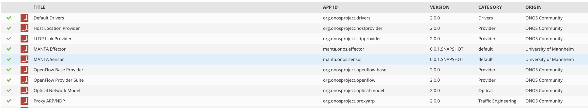

# Host1: SDN Controller

Host1 runs the ONOS SDN controller using Version 2.0 (Quail). The two oar files contain the used ONOS sensor and effector implementations which must be installed on your ONOS instance. The following applications must be running on your ONOS instance:

