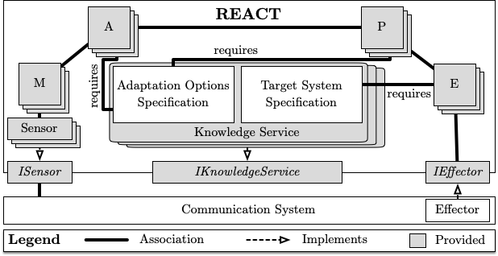

# ACSOS 2020 Supplementary Material

This repository contains supplementary material for the ACSOS 2020 full paper (*REACT: A Model-Based Runtime Environment for Adapting Communication Systems*) and demo (*Enhancing a Communication System with Adaptive Behavior using REACT*) submissions presenting **REACT** (**R**untime **E**nvironment for **A**dapting **C**ommunication Sys**T**ems).

REACT allows domain experts to make their systems adaptive in an easy-to-use manner. REACT uses [Clafer](https://www.clafer.org/) in version 0.4.5 available [here](https://gsd.uwaterloo.ca/clafer-tools-binary-distributions.html). A documentation wiki of Clafer can be found [here](http://t3-necsis.cs.uwaterloo.ca:8091/).

[Here](Configuration_File_Options.md) you can find all available configration file options of REACT.

Everything has been executed and tested using Ubuntu 18.04.

### [Full Paper Material](REACT-A_Model-Based_Runtime_Environment_for_Adapting_Communication_Systems/README.md)

### [Demo Material](Enhancing_a_Communication_System_with_Adaptive_Behavior_using_REACT/README.md)
